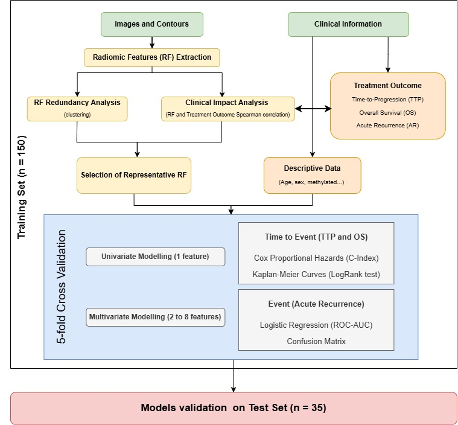

# Radiomics Model Development

A script-based pipeline for developing and evaluating radiomics models for treatment outcome prediction, as illustrated in Figure 1.

<p align="center">
  
  <br>
  <em>Figure 1. Analysis flowchart for radiomics model development.</em>
</p>


## Contents

```
Radiomics_Model_Development/
├── run_prepare_features.sh                      --> prepare input 
├── run_train_validation_event.sh                --> training - Event
├── run_train_validation_time_to_event.sh        --> training - Time-to-Event
├── run_evaluate_test_set.sh                     --> test set evaluation
├── docs/                                        --> Event_Workflow.md, Time_to_Event_Workflow.md -- the statistical methodology
├── input_templates/
│   ├── prepare_features/ raw_treatment_outcome_template.csv    -->  template for the raw treatment-outcome CSV
│   ├── model_development/ clinical_features_template.csv + config files       -->  optional template for clinical data + config files
└── code/
    ├── data_preparation/        --> prepare_features_and_endpoints.py
    ├── train_val_test/          --> event.py, time_to_event.py, evaluate_feature_subset.py, explore_feature_subsets.py
    ├── models/                  --> Cox Proportional Hazards (CoxPH) and Kaplan-Meier plotting
    └── feature_selection/       --> redundancy analysis, clustering-based feature selection, statistical tests
    
   
```

---

## Requirements

### Folder structure 

`DATA_DIR` → `/data`:

```
my_data/                                  <- DATA_DIR
├── your_radiomic_features.csv            <- output from the workflow 1 Radiomic_Feature_Extraction (see detailed description of the format in Input Files)
└── your_raw_treatment_outcome.csv        <- reatment-outcome data in the format specified in input_templates/prepare_features/raw_treatment_outcome_template.csv (see detailed description in Input Files)
```


### Input files

([`Radiomic_Feature_Extraction/`](../Radiomic_Feature_Extraction)), workflow 1 from the current repository, computes the radiomics features required for radiomics model development. The following steps reformat this output together with the treatment-outcome data into the features.csv / endpoints.csv format required for [`Model Development`](##Model-Development)

Copy `input_templates/prepare_features/raw_treatment_outcome_template.csv` and fill it in with the corresponding patient treatment-outcome data of your cohort.

<details>
<summary><code>raw_treatment_outcome_template.csv</code> column reference</summary>

| Column | Description | Possible values |
|---|---|---|
| `Patient` | Patient identifier, must match the `Patient` values used in `input.csv` / your features CSV. | Any text. |
| `Progression` | Whether the patient progressed. | `1` (yes) or `0` (no). |
| `Time to Progression (TTP)` | Days from the end of radiotherapy to progression (or to last follow-up, if it hasn't happened yet). | Non-negative number of days. |
| `Acute Recurrence` | Whether the patient progressed within 90 days. | `1` (yes) or `0` (no). |
| `Overall survival` | Days from the end of radiotherapy to death (or to last known follow-up ). | Days. |
| `Death` | Whether the patient died. | `1` (yes) or `0` (no). |

</details>


### Run the code


At the top of `run_prepare_features.sh`, edit `DATA_DIR`, `FEATURES_FILE` and `ENDPOINTS_FILE`. Leave `ENDPOINTS_FILE` as `""` to only reformat the features table. Then run it from inside this folder:

```bash
cd Radiomics_Model_Development
./run_prepare_features.sh
```

It generates features.csv and endpoints.csv in the same directory as the input files.

---

## Model Development

Code for Radiomics Model trainning and test based on the workflow depicted in Figure 1. 

### Folder structure requirements

Predefining this folder structure is recommended to facilitate running the code.

`PROJECT_DIR` → `/data`

```
my_experiment/                       <- this is your PROJECT_DIR
├── your_config.json                 <- copied from input_templates/model_development/, edited (CONFIG_FILE)
└── inputs/
    ├── features.csv                  <- output from run_prepare_features.sh 
    ├── endpoints.csv                 <- output from run_prepare_features.sh 
    └── your_clinical_features.csv    <- optional: clinical data in the format specified in input_templates/model_development/clinical_features_template.csv (see detailed description in Input Files)
```

`CONFIG_FILE` → `your_config.json`

Results are written to `<PROJECT_DIR>/results/<experiment_name>/<timestamp>/`.

### Input template reference

<details>
<summary><code>evaluation_test_set_config.json</code> field reference</summary>

| Field | Description | Possible values |
|---|---|---|
| `experiment_name` | Names the results subfolder. | Any text, e.g. `"example_experiment/test"`. |
| `evaluation_type` | Whether to evaluate via cross-validation or against a held-out test set. | `"Cross Validation"` or `"Train-Test"`. |
| `root_dir` | Docker mount point; every path below is relative to it. | Always `"/data"`. |
| `radiomic_features` | Path to the training features CSV (the one used to originally train the feature subset). | Any path relative to `root_dir`, e.g. `"inputs/features.csv"`. |
| `clinical_features` *(optional)* | Path to the training clinical-features CSV, if used. | Any path, or `null`. |
| `endpoints` | Path to the training endpoints CSV. | Any path relative to `root_dir`. |
| `test_radiomic_features` | Path to the external test set's features CSV, same column format as the training CSV. | Any path relative to `root_dir`. |
| `test_clinical_features` *(optional)* | Path to the external test set's clinical-features CSV, if used. | Any path, or `null`. |
| `test_endpoints` | Path to the external test set's endpoints CSV, same column format as the training CSV. | Any path relative to `root_dir`. |
| `id_column` | The column with patient IDs. | A column name, e.g. `"Patient"`. |
| `duration_column` | The duration column for the outcome you're evaluating. | `""` (Acute Recurrence), `"Time to Progression (TTP)"`, or `"Overall survival"`. |
| `event_column` | The event column for the outcome you're evaluating. | `"Acute Recurrence"`, `"Progression"`, or `"Death"`. |
| `features` | The exact feature subset to evaluate. | A list of feature names, copied from `feature_subset` / `feature` in the `results.json` of an earlier training run. |
| `scoring_method` | Metric(s) reported for the evaluation. | A list, e.g. `["log_likelihood"]`. |
| `scoring_method_ascending` | Whether a higher score is better. | `true` or `false`. |
| `save` | Whether to save results, logs and plots. | `true` or `false`. |

</details>

<details>
<summary><code>clinical_features_template.csv</code> column reference</summary>

| Column | Description | Possible values |
|---|---|---|
| `Patient` | Patient identifier, must match the `Patient` values used in your features/endpoints CSVs. | Any text. |
| `Age` | Patient age at treatment. | Non-negative number. |
| `Sex` | Patient sex. | `0` = male (hombre), `1` = female (mujer). |
| `Multifocal` | Whether the tumour is multifocal. | `1` (yes) or `0` (no). |
| `Maximum diameter(s) [mm]` | Maximum tumour diameter. | Non-negative number, in mm. |
| `Surgery for (re-)current GBM` | Whether the patient had surgery for the (recurrent) GBM. | `1` (yes) or `0` (no). |
| `(Re-)current GBM localisation: Right Hemisphere` | Whether the (recurrent) GBM is located in the right hemisphere. | `1` (yes) or `0` (no). |
| `(Re-)current GBM localisation: Left Hemisphere` | Whether the (recurrent) GBM is located in the left hemisphere. | `1` (yes) or `0` (no). |
| `(Re-)current GBM localisation: Frontal` | Whether the (recurrent) GBM is located in the frontal lobe. | `1` (yes) or `0` (no). |
| `(Re-)current GBM localisation: Parietal` | Whether the (recurrent) GBM is located in the parietal lobe. | `1` (yes) or `0` (no). |
| `(Re-)current GBM localisation: Temporal` | Whether the (recurrent) GBM is located in the temporal lobe. | `1` (yes) or `0` (no). |
| `Methylated` | Whether the tumour is MGMT-methylated. | `1` (yes) or `0` (no). |

</details>

### Run the code

Edit `CONFIG_FILE` and `PROJECT_DIR` at the top of the `*.sh` script, then run it from inside this folder.

| Aim | CONFIG_FILE template | Fields to adapt | Command |
|---|---|---|---|
| Model development for Acute Recurrence | [`train_val_acute_recurrence_config.json`](input_templates/model_development/train_val_acute_recurrence_config.json) | `radiomic_features`, `endpoints`, `clinical_features` | `./run_train_validation_event.sh` |
| Model development for Time to Progression | [`train_val_time_to_progression_config.json`](input_templates/model_development/train_val_time_to_progression_config.json) | `radiomic_features`, `endpoints`, `clinical_features` | `./run_train_validation_time_to_event.sh` |
| Model development for Overall Survival | [`train_val_overall_survival_config.json`](input_templates/model_development/train_val_overall_survival_config.json) | `radiomic_features`, `endpoints`, `clinical_features` | `./run_train_validation_time_to_event.sh` |
| Evaluating a feature subset on the test set | [`evaluation_test_set_config.json`](input_templates/model_development/evaluation_test_set_config.json) | `radiomic_features`, `endpoints`, `clinical_features`, `test_radiomic_features`, `test_endpoints`, `test_clinical_features`, `features` | `./run_evaluate_test_set.sh` |

---

## Related documents

- [`docs/Event_Workflow.md`](docs/Event_Workflow.md): step-by-step statistical workflow for event (classification) analysis.
- [`docs/Time_to_Event_Workflow.md`](docs/Time_to_Event_Workflow.md): step-by-step statistical workflow for time-to-event (survival) analysis.
